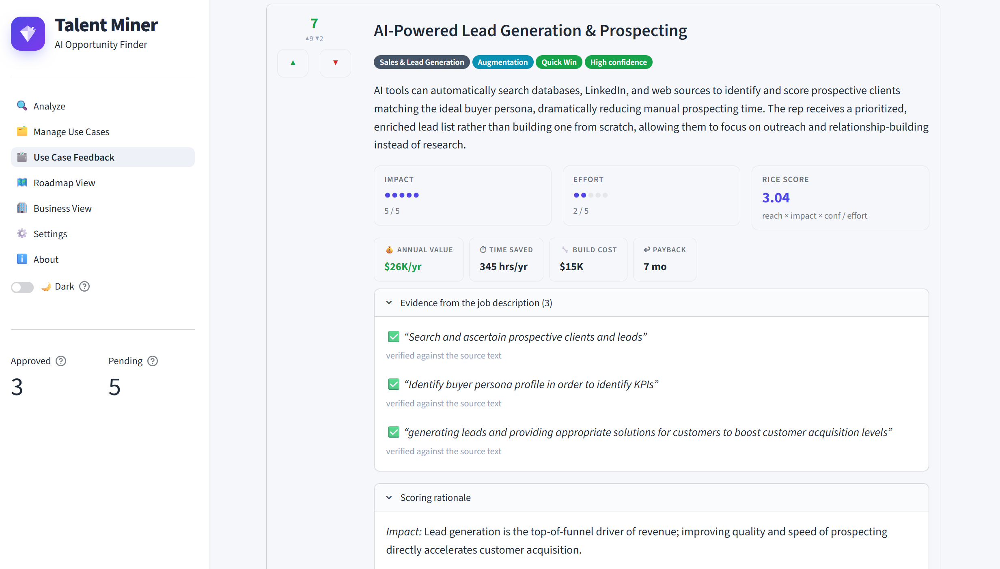
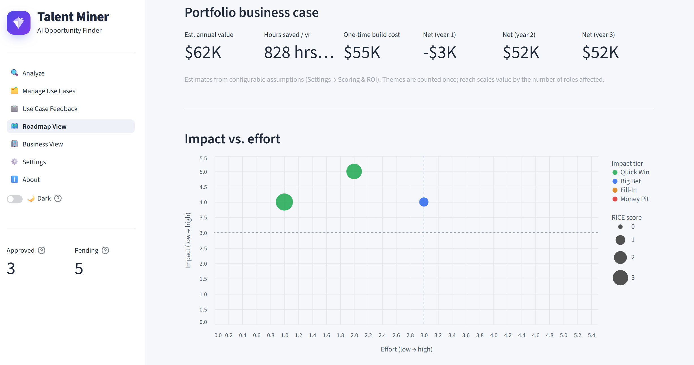
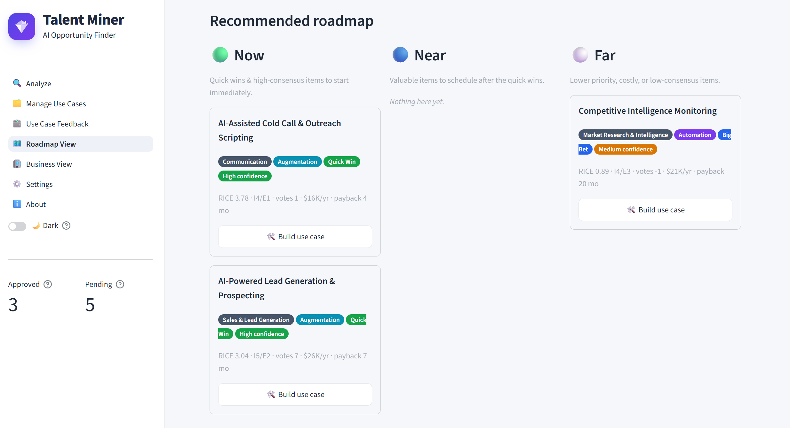

# Talent Miner

*AI Opportunity Finder*

A Streamlit app that reads job descriptions (PDF, Word, URL, or pasted text), uses a
configurable AI model to find where AI could **automate or augment** the role, lets your
team **review, vote, and prioritize** opportunities, and rolls the result into a
**roadmap and business view** — all with **no external database** (state is kept in flat
JSON files).

---

## What it does

1. **Analyze** — upload a PDF/Word/text file, paste a URL, or type a job description.
   The app extracts text locally and calls your configured AI model to surface concrete
   AI use cases, each scored by **impact** and **effort**.
2. **Manage Use Cases** — review all derived use cases; **approve** the ones worth
   pursuing (or reject/delete). Approval is the gate that feeds everything downstream.
3. **Use Case Feedback** — the team **votes** (👍 / 👎) on approved use cases. Votes
   feed the RICE priority ranking on the Roadmap.
4. **Roadmap View** — filter by functional area, capability, and impact tier; see an
   impact/effort quadrant and **Now / Near / Far** lanes driven by RICE scores and votes.
   Includes ROI estimates. Exportable to CSV/JSON.
5. **Business View** — groups approved use cases by **business function** so leaders can
   see how many use cases each function has, estimated value, and cross-role reach.
6. **Use Case Builder** — from any roadmap item click **Build use case** to have AI
   draft a decision-ready brief (problem, solution, data needs, business impact,
   implementation plan, risks, success metrics). Downloadable as **Markdown or PDF**.
7. **About** — project background and version info.

Toggle **light/dark mode** from the header on any page.

## Screenshots








## Quick start

```bash
cd "Talent Miner"
python -m venv .venv && source .venv/bin/activate   # Windows: .venv\Scripts\activate
pip install -r requirements.txt
streamlit run app.py          # or: ./run.sh
```

Then open the URL Streamlit prints (default http://localhost:8501).

> The app starts in **Demo (offline)** mode, so you can click through the entire workflow
> immediately without any API key. Switch to a real model on the **Settings** page.

## Configuring a real model

Open the **⚙️ Settings** page and pick a provider:

| Provider          | What you need                                                                        |
| ----------------- | ------------------------------------------------------------------------------------ |
| Demo (offline)    | Nothing — local heuristic, good for trying the UI.                                  |
| Ollama            | A running [Ollama](https://ollama.com) instance and a pulled model.                  |
| Claude            | `ANTHROPIC_API_KEY` (env var or paste in Settings). `pip install anthropic`          |
| OpenAI            | `OPENAI_API_KEY` (env var or paste in Settings). `pip install openai`                |
| OpenAI via Azure  | `AZURE_OPENAI_API_KEY`, endpoint, deployment name, and API version.                  |

Keys can be set as environment variables (create a `.env` file — `python-dotenv` loads
it automatically) or entered directly in Settings (session-only, never written to disk).
Use **Settings → Test connection** to verify.

## How prioritization works

Each opportunity gets an AI-estimated **impact** (1–5), **effort** (1–5), and
**confidence** percentage. Recurring use cases across roles are clustered into themes
with a **reach** count (how many roles they touch).

The default scoring method is **RICE**:

```
RICE = (Reach × Impact × Confidence) / Effort
```

A small optional vote nudge adjusts the score based on net team votes. Opportunities are
also placed in an impact/effort quadrant — **Quick Win**, **Big Bet**, **Fill-In**,
**Money Pit** — and bucketed into **Now / Near / Far** lanes. A legacy linear weighted
formula (`w_impact × impact − w_effort × effort + w_votes × net_votes`) is available as
an alternative via `scoring.method` in `config.yaml`.

ROI estimates (dollar/time value) are computed from impact, effort, reach, and
configurable assumptions (loaded hourly cost, headcount per role, etc.) set in Settings.

## Project structure

```
Talent Miner/
├── app.py                      # Home: ingest + analyze a job description
├── pages/
│   ├── 1_Manage_Use_Cases.py   # Approve / reject / delete derived use cases
│   ├── 2_Roadmap_View.py       # Filters + ROI + impact/effort matrix + Now/Near/Far
│   ├── 3_Settings.py           # Provider/model/keys/weights/ROI assumptions
│   ├── 4_Use_Case.py           # AI use-case document builder (per roadmap item)
│   ├── 5_Business_View.py      # Use cases grouped by business function
│   ├── 6_About.py              # Project background and version
│   └── 7_Use_Case_Feedback.py  # Team voting on approved use cases
├── ui_common.py                # Shared Streamlit helpers (theme, header, sidebar, cards)
├── core/
│   ├── ingestion.py            # Local PDF/Word/URL extraction → normalized JSON
│   ├── providers.py            # AI provider abstraction (Ollama/Claude/OpenAI/Azure/Demo)
│   ├── analysis.py             # Prompt + parsing → Opportunity objects
│   ├── scoring.py              # RICE / weighted scoring, quadrant, lanes
│   ├── clustering.py           # Groups same use cases across roles into themes with reach
│   ├── roi.py                  # Dollar/time ROI estimates from impact, effort, and reach
│   ├── exporting.py            # CSV/JSON/PDF export helpers
│   ├── storage.py              # Atomic flat-file JSON persistence (no DB)
│   ├── models.py               # SourceDocument & Opportunity dataclasses
│   └── config.py               # config.yaml + env-var key resolution
├── config.yaml                 # Default provider, model, weights, ROI assumptions
├── data/                       # documents.json, opportunities.json (created at runtime)
├── requirements.txt
├── .streamlit/config.toml      # Theme + upload size
└── run.sh
```

## Data & persistence

All state is in `data/`:

- `documents.json` — normalized source documents (metadata + cleaned text).
- `opportunities.json` — every use case, including status, votes, clustering metadata,
  and any generated use-case brief attached to it.

Writes are atomic (temp file + `os.replace`) and guarded by an in-process lock —
sufficient for a single Streamlit server with up to ~20 concurrent sessions. Delete the
JSON files (or use **Settings → Danger zone**) to reset.

## Scope notes

No authentication, no user tracking, no external database. For a shared deployment, run
behind your normal reverse proxy/SSO and set API keys as environment variables rather
than entering them in the UI.
